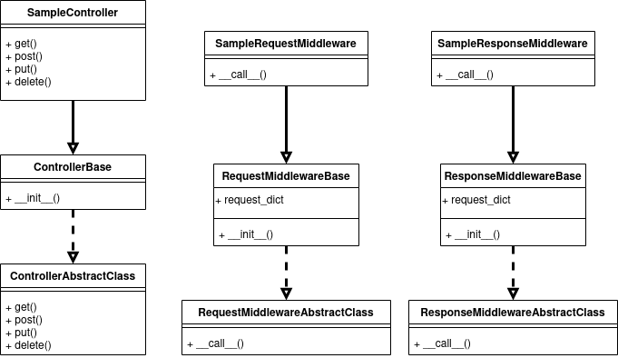
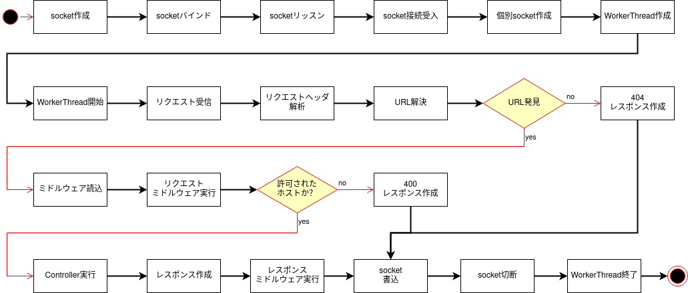
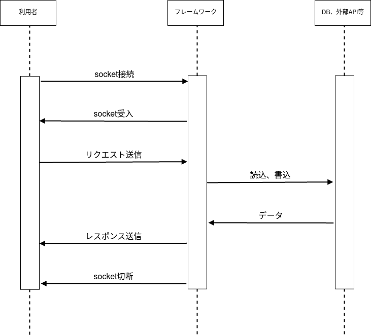

# SlowAPI

力技自作マイクロWebフレームワーク

 

# 実装済み機能

## 基本機能

- リクエスト受信
- リクエスト解析
- URL解決・パスパラメータ解析
- ミドルウェア実行
- ユーザが実装したコントローラへのディスパッチ
- レスポンス送信

## セキュリティ

- SQLインジェクション対策
- HTTPヘッダインジェクション対策(許可されたホストのIPアドレスを指定)

 

# ユーザ側実装方法

## コントローラ
	"framework.controller.base.ControllerBase"を継承して実装してください。

	使いたいHTTPメソッドに合わせて、get()・post()・put()・delete()を実装してください。

	必ず"framework.controller.generator"内の"generate_controller_response_dict"関数で作成したディクショナリをリターンしてください。(していない場合、バリデーションエラーが発生します。)

	"generate_controller_response_dict"関数には、引数として"status_code:int"、"custom_headers:dict"、"body:str"を渡してください。

	デフォルトの"Content-Type"は"application/json"になっています。

	変更する場合は"custom_headers['Content-Type']"で変更してください。

## URL
	"url_patterns"リストに"{'url':'任意のURL', 'controller':任意のControllクラス, 'middlewares':[任意のミドルウェアクラス<0個以上>]}"の形で指定してください。

	パスパラメータは"<"と">"で括ってください。

	実行順序のあるミドルウェアは、その順序通りにリストに指定してください。

## カスタムミドルウェア
	自作のミドルウェアを実装する場合は、"framework.middleware.base"内の"RequestMiddlewareBase"または"ResponseMiddlewareBase"を継承して実装してください。

	上記基底クラスは、それぞれリクエスト用とレスポンス用となっています。

	"__call__"関数内に処理を実装してください。

	"self.request_dict"または"self.response_dict"でリクエスト、レスポンス内容を取得できます。

	必ず"self.request_dict"または"self.response_dict"をリターンしてください。

 
 

# UML

## クラス図

 

## アクティビティ図

 

## シーケンス図

 
 

# 課題

## ソケット通信

ソケットの受信でループを使用するとブロッキングが発生する。

現状では受信は4096bytesに制限されている。

 

## 高速化

for文を回すことしか思いつかないため、動作が遅くなっている。

また、URL解決にLRUキャッシュを使用する予定であったが、引数の型の都合で使用できなかった。

 

## 使用のし易さ

作った本人でも２週間後には使い方がわからなくなっていた。

 
 

# 経過

	2022年
		1月10日 実装開始。ソケット通信のベースから実装
		1月11日 ディスパッチ機能実装
			URLから任意のコントローラクラスに実装したメソッドを呼び出し可能に
		1月12日 パスパラメータ機能実装
			<>で括ったところをパスパラメータとして処理可能に
			ただし、パスパラメータを使用する場合はパラメータを必ず与えないとエラーになる状態
		1月13日 ミドルウェア機能を実装、URLリゾルバの不具合解消
			リクエスト、レスポンス別にミドルウェアを実行する機能を実装
			URLリゾルブで複数マッチした場合、最長一致で決定する機能を追加
		1月14日 リファクタリング
			dispatcherメソッドに何でも書きすぎていたためリファクタリング
		1月28日 コード修正

 
 

# 参考

「[伸び悩んでいる3年目Webエンジニアのための、Python Webアプリケーション自作入門](https://zenn.dev/bigen1925/books/introduction-to-web-application-with-python)」の第１３章。